<!-- GRID:START -->

  

<!-- GRID:END -->

<!-- PET:START -->

  

<!-- PET:END -->

### whoami

Engineer working on **AI-agent security** — benchmarks and guardrails for the ways agents get
tricked, and writing about the honest ways they break.

- 🛡️ [buried-injections](https://github.com/rudratoshs/buried-injections) — 10 prompt-injection detectors vs 629 real agent attacks
- 🚦 [taintgate](https://github.com/rudratoshs/taintgate) — a provenance-aware policy gate for agent tool calls
- ✍️ writing at [dev.to/rudratosh](https://dev.to/rudratosh)

The scene above is a self-updating animated SVG built from my own GitHub activity: an isometric
datacenter with one server rack per repository, colour-coded by language, defended by a live firewall —
plus a commit-fed virtual pet. Both refresh daily, no human in the loop.
Source + build-your-own: <a href="https://github.com/rudratoshs/rudratoshs">this repo</a>.
