<!-- SOC:START -->

  

<!-- SOC:END -->

<!-- PET:START -->

  

<!-- PET:END -->

### whoami

Engineer working on AI-agent security. I build benchmarks and guardrails for the ways agents
get tricked — and write about the honest ways they break.

- 🛡️ [buried-injections](https://github.com/rudratoshs/buried-injections) — 10 prompt-injection detectors vs 629 real agent attacks
- 🚦 [taintgate](https://github.com/rudratoshs/taintgate) — a provenance-aware policy gate for agent tool calls
- ✍️ writing at [dev.to/rudratosh](https://dev.to/rudratosh)

The two consoles above are self-updating animated SVGs built from my own GitHub activity —
a security-operations dashboard and a commit-fed virtual pet. They refresh daily, no human in the loop.
Source + how to build your own: <a href="https://github.com/rudratoshs/rudratoshs">this repo</a>.
